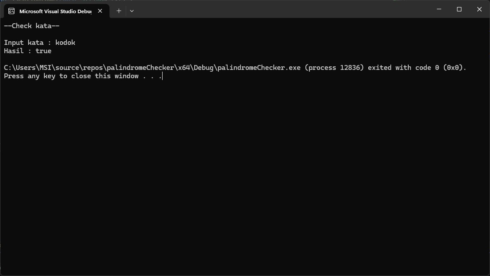

# Palindrome Checker

## Deskripsi

Program ini merupakan aplikasi sederhana dalam C++ yang berfungsi untuk memeriksa apakah suatu kata adalah palindrome. Palindrome adalah kata, frasa, angka, atau urutan karakter lain yang dibaca sama dari depan maupun belakang (misalnya, "radar" atau "level").

Program ini memiliki dua metode untuk memeriksa palindrome:

### Metode : `isPalindrome2` 

- **Parameter**: `string txt`

  Menggunakan parameter string biasa, yang berarti membuat salinan dari string ketika fungsi dipanggil.

- **Proses**:
  1. Membalik string dan membandingkannya dengan string asli.
  2. Mengembalikan `true` jika keduanya sama, dan `false` jika tidak.
## Kode

```cpp
#include <iostream>
using namespace std;

void main() {
	string txt;
	cout << "---Check kata---\n\n";
	cout << "Input kata : "; cin >> txt;

	string txtRev = txt;
	reverse(txtRev.begin(), txtRev.end()); 

	cout << "Hasil : " << boolalpha << (txtRev == txt) ? true : false;
}
```

## Hasil eksekusi



