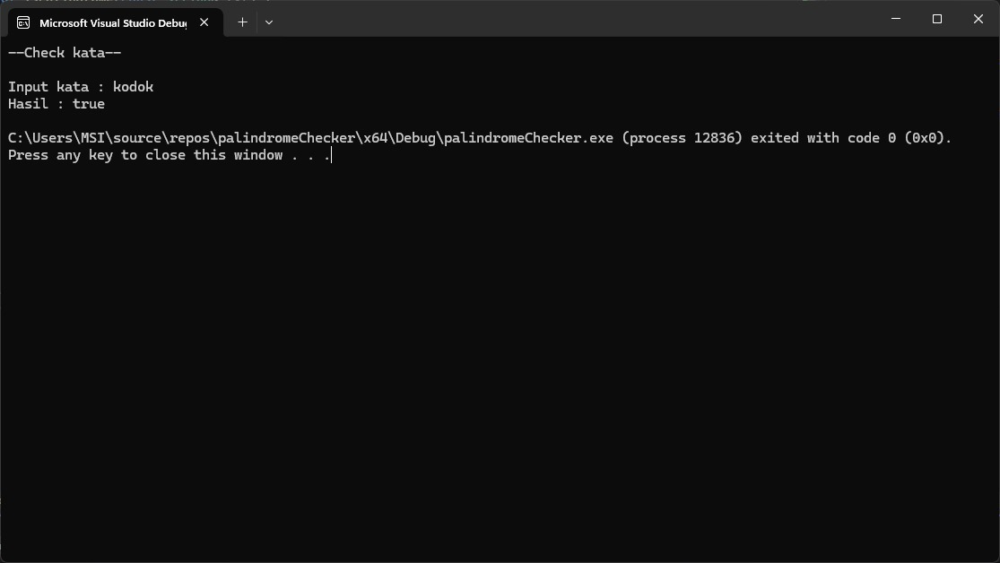

# Palindrome Checker

## Deskripsi

Program ini merupakan aplikasi sederhana dalam C++ yang berfungsi untuk memeriksa apakah suatu kata adalah palindrome. Palindrome adalah kata, frasa, angka, atau urutan karakter lain yang dibaca sama dari depan maupun belakang (misalnya, "radar" atau "level").

Program ini memiliki dua metode untuk memeriksa palindrome:

### Metode 1: `isPalindrome`

- **Parameter**: `const string& txt`

  Menggunakan referensi ke string (`const string&`) untuk menghindari salinan yang tidak perlu, sehingga meningkatkan efisiensi memori dan kecepatan eksekusi.

- **Proses**:
  1. Menggunakan dua indeks (`left` dan `right`) untuk membandingkan karakter dari kedua sisi string.
  2. Jika karakter di posisi `left` dan `right` tidak sama, fungsi mengembalikan `false`.
  3. Jika semua karakter cocok, fungsi mengembalikan `true`.

- **Kelebihan `isPalindrome` dibandingkan `isPalindrome2`**:
  - **Efisiensi Memori**: Fungsi `isPalindrome` tidak membuat salinan dari string, sehingga lebih efisien dalam penggunaan memori, terutama untuk string yang besar.
  - **Kecepatan Eksekusi**: Tanpa salinan yang dibuat, `isPalindrome` lebih cepat, terutama saat memeriksa palindrom dalam konteks di mana fungsi sering dipanggil atau di dalam loop.
  - **Sederhana dan Langsung**: Algoritma yang digunakan dalam `isPalindrome` lebih langsung dan tidak memerlukan langkah tambahan untuk membalik string.

### Metode 2: `isPalindrome2` (Opsional)

- **Parameter**: `string txt`

  Menggunakan parameter string biasa, yang berarti membuat salinan dari string ketika fungsi dipanggil.

- **Proses**:
  1. Membalik string dan membandingkannya dengan string asli.
  2. Mengembalikan `true` jika keduanya sama, dan `false` jika tidak.

## Kode

```cpp
#include <iostream>
using namespace std;

// sedikit lebih komplex namun lebih cepat dalam eksekusi
bool isPalindrome(const string& txt) {
    int left = 0;
    int right = txt.length() - 1;
    while (right > left) if (txt[left++] != txt[right--]) return false;
    return true;
}

// lebih mudah dipahami tapi lebih lambat
bool isPalindrome2(string txt) { 
    string txtRev = txt;
    reverse(txtRev.begin(), txtRev.end());
    return (txtRev == txt) ? true : false;
}

int main() {
    string kata;
    cout << "--Check kata--\n\n";
    cout << "Input kata : "; cin >> kata;
    cout << "Hasil : " << boolalpha << isPalindrome(kata) << endl;
}

## Hasil eksekusi



